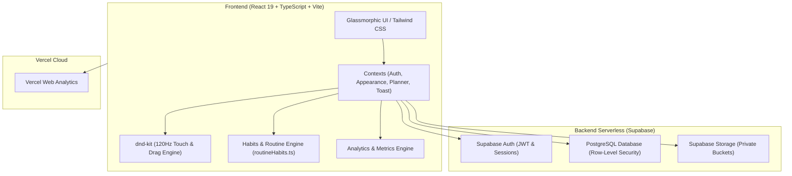

# ⏳ TimeBox Hub — Maestría del Tiempo & Enfoque Profundo

<div align="center">


[](https://react.dev/)
[](https://www.typescriptlang.org/)
[](https://vitejs.dev/)
[](https://tailwindcss.com/)
[](https://supabase.com/)
[](https://vercel.com/)
[](https://web.dev/progressive-web-apps/)

<p align="center">
  <b>Una plataforma moderna, fluida y estética diseñada bajo la metodología Timeboxing para transformar intenciones en ejecución implacable.</b>
</p>

[✨ Características](#-características-principales) •
[📐 Metodología](#-la-filosofía-del-timeboxing) •
[📱 PWA & 120Hz](#-instalación-en-celular-tablet-y-pc-pwa) •
[📊 Dashboard Analítico](#-dashboard-analítico-y-discrepancia) •
[🚀 Inicio Rápido](#-inicio-rápido) •
[🛠️ Arquitectura](#-arquitectura-técnica)

</div>

---

## 🎯 ¿Qué es TimeBox Hub?

Las listas de pendientes tradicionales (*To-Do Lists*) fallan porque ignoran la dimensión fundamental de la realidad: **el tiempo finito**. **TimeBox Hub** combina la disciplina del timeboxing (utilizada por líderes como Elon Musk, Bill Gates y Carl Newport) con una interfaz **Glassmorphic** de alta fidelidad, reactiva y ultra-optimizada para pantallas de hasta **120Hz**.

En lugar de preguntarte *"¿qué debería hacer hoy?"*, abres tu jornada sabiendo exactamente **qué harás, cuándo lo harás y cuánto tiempo le dedicarás**, eliminando la fatiga de decisión y derrotando la Ley de Parkinson.

---

## ✨ Características Principales

### ⏱️ Planificación Diaria y Timeboxing Puro
- **Grid interactivo de 24 horas (AM/PM):** Visualiza tu día completo con intervalos precisos de 15 minutos.
- **Arrastre fluido (120fps Drag & Drop):** Soporte de puntero táctil de alta precisión para móviles, tablets y ratón en PC.
- **Redimensionamiento con previsualización en vivo:** Alarga o acorta la duración de una tarea arrastrando su borde inferior y observa en tiempo real a qué hora exacta terminará (`Termina: 5:15 PM · 45 min`).
- **Bandeja "Sin hora":** Deposita tareas asignadas a un día sin horario fijo para estructurarlas cuando estés listo.
- **Planificación directa:** Añade tareas directamente a un horario específico o a cualquier día sin necesidad de arrastrar.

### 🔄 Rutinas Cotidianas y Hábitos Cuantificables
- **Plantillas rápidas integradas:** Duolingo, Lectura de libros, Ejercicio físico, Dormir, Comida, Transporte, Ocio y Código.
- **Creador de hábitos personalizados:** Define tus propias rutinas con métricas cuantificables (ej. *leer 5 páginas*, *1 lección de idiomas*, *10 km*), horario sugerido y color de acento.
- **Persistencia local automática:** Tus plantillas creadas quedan guardadas en tu dispositivo para uso instantáneo.

### ❌ Control de Cumplimiento y Aprendizaje de Fallos
- **Registro tridimensional de resultados al terminar un bloque:**
  - 🟢 **Completada a tiempo:** Cumplida en el rango previsto.
  - 🟡 **Fallida en tiempo:** Tomó más de lo programado (revelando cuellos de botella).
  - 🔴 **No realizada / Abandonada:** Cancelada o no iniciada (para auditar prioridades reales).
- **Métrica de avance alcanzado:** Ingresa las unidades completadas (ej. *7 páginas leídas*) para alimentar el progreso de tus hábitos.
- **Análisis de Áreas Críticas:** El sistema identifica automáticamente en qué áreas de tu vida (Trabajo, Estudio, Salud, etc.) tienes mayor tasa de fallo.

### 📊 Dashboard Analítico y Discrepancia
- **Multi-rango temporal:** Navega por Día, Semana, Mes o Año con controles fluidos.
- **Métrica de Discrepancia (Plan Inicial vs. Realidad):** Mide la brecha entre el tiempo planificado y el tiempo que realmente te tomó ejecutarlo.
- **Horas pico de productividad:** Gráfica de densidad horaria de 6:00 AM a 12:00 AM para conocer cuándo concentras tu mayor carga de trabajo.
- **Detección inteligente de bloques libres:** Encuentra ventanas de descanso o disponibilidad de 8:00 AM a 10:00 PM.
- **Distribución por Ámbitos:** Visualización porcentual del tiempo dedicado a cada área de tu vida.

### 📁 Gestor Universal de Archivos por Tarea
- **Compatibilidad extendida:** Adjunta imágenes (PNG, JPG, WebP, SVG, GIF), documentos (PDF, Word, Excel, XLSM, CSV, JSON, XML), código y configuraciones (JS, TS, Python, C++, Arduino `.ino`, ESP32, TOML, YAML), archivos comprimidos (ZIP, RAR) y enlaces web externos.
- **Visor integrado (Modal Maximizado):** Previsualiza fotos, documentos y datos directamente dentro de la aplicación sin salir de tu flujo.
- **Acceso omnicanal:** Revisa y descarga los archivos de una tarea tanto desde la Vista General como desde la Agenda Diaria.

### 🔔 Notificaciones Proactivas
- **Alertas antes de empezar:** Notificaciones automáticas de audio y sistema 3 minutos antes del inicio de cada bloque para preparar tu contexto de trabajo.
- **Soporte multiplataforma:** Funciona nativamente en navegadores modernos en Windows, Android, macOS e iOS.

### 🎨 Estética Glassmorphic & Ergonomía Visual
- **Aura de iluminación interactiva:** Resplandor sutil adaptativo que sigue el cursor del ratón o la posición táctil sin penalizar los cuadros por segundo.
- **Modo Claro / Oscuro Inteligente:** Atenuación automática del fondo de pantalla según el tema activo para garantizar legibilidad y alto contraste en cualquier condición de luz.
- **Diseño sin parpadeos:** Cursores y selectores estilizados con prevención de selecciones accidentales.

---

## 📱 Instalación en Celular, Tablet y PC (PWA)

TimeBox Hub está construido como una **Progressive Web App (PWA)** de última generación. Puedes instalarla directamente en tus dispositivos con la misma experiencia y rendimiento que una aplicación nativa `.apk` o `.exe`, sin tiendas de aplicaciones ni descargas pesadas.

### 🤖 En Android / Tablet (Experiencia APK Nativa)
1. Abre tu navegador (Google Chrome o Microsoft Edge) y entra en la URL de la aplicación.
2. Pulsa en el menú de tres puntos (**⋮**) arriba a la derecha.
3. Selecciona **"Instalar aplicación"** o **"Agregar a la pantalla principal"**.
4. ¡Listo! Se creará un acceso directo independiente con su propio ícono y pantalla completa sin barras del navegador.

> [!TIP]
> **Aprovechando pantallas de 90Hz / 120Hz:**
> TimeBox Hub utiliza aceleración por hardware (`will-change`, CSS transform 3D y `translateZ(0)`). Para disfrutar de la máxima fluidez a 120fps en tu móvil o tablet, asegúrate de que el modo de **Ahorro de batería** esté desactivado y que la opción **"Pantalla fluida / 120Hz"** esté habilitada en los ajustes de pantalla de tu dispositivo.

### 💻 En Windows / PC (Experiencia .EXE de Escritorio)
1. Abre la aplicación en Google Chrome o Microsoft Edge.
2. En la barra de direcciones aparecerá un ícono de instalación (una computadora pequeña con una flecha hacia abajo).
3. Haz clic en **"Instalar TimeBox Hub"**.
4. La aplicación se ejecutará en una ventana independiente, se anclará a tu barra de tareas y al menú Inicio de Windows.

### 🍎 En iPad / iPhone (iOS)
1. Abre la aplicación en Safari.
2. Toca el botón **Compartir** (cuadrado con flecha hacia arriba).
3. Elige **"Agregar a pantalla de inicio"**.

---

## 🛠️ Arquitectura Técnica



### Stack de Tecnologías
- **Core:** [React 19](https://react.dev/), [TypeScript](https://www.typescriptlang.org/), [Vite](https://vitejs.dev/)
- **Estilos:** [Tailwind CSS 4](https://tailwindcss.com/), Glassmorphism, CSS Custom Properties
- **Motor Drag & Drop:** [@dnd-kit/core](https://dndkit.com/), [@dnd-kit/utilities](https://dndkit.com/)
- **Iconografía:** [Lucide React](https://lucide.dev/)
- **Backend & Base de Datos:** [Supabase](https://supabase.com/) (PostgreSQL con RLS, Storage Buckets, Auth)
- **Analíticas:** [@vercel/analytics](https://vercel.com/analytics)

---

## 🚀 Inicio Rápido

### Requisitos Previos
- [Node.js](https://nodejs.org/) v18+ o superior
- Gestor de paquetes `npm`, `pnpm` o `yarn`

### 1. Clonar el Repositorio
```bash
git clone https://github.com/Jechavaria/timebox-hub.git
cd timebox-hub/timeboxing-app
```

### 2. Instalar Dependencias
```bash
npm install
```

### 3. Configurar Variables de Entorno
Crea un archivo `.env` en la raíz de `timeboxing-app` con tus credenciales de Supabase:
```env
VITE_SUPABASE_URL=https://tu-proyecto.supabase.co
VITE_SUPABASE_ANON_KEY=tu-anon-key-de-supabase
```

### 4. Ejecutar en Modo Desarrollo
```bash
npm run dev
```
Abre en tu navegador `http://localhost:5173`.

### 5. Compilar para Producción
```bash
npm run build
```

---

## 📐 La Filosofía del Timeboxing

El timeboxing se basa en tres principios de psicología del trabajo:

1. **Ley de Parkinson:** *"El trabajo se expande hasta llenar el tiempo disponible para su realización."* Al asignar una caja de tiempo definida (ej. 45 min), tu cerebro optimiza el esfuerzo para concluir dentro del límite.
2. **Cero Multitarea:** Una sola tarea a la vez en tu pantalla y en tu mente.
3. **Calibración continua de la Discrepancia:** Al comparar tu tiempo planeado con tu tiempo real, aprendes con cada jornada a estimar con mayor precisión, reduciendo el optimismo ilusorio.

---

## 📄 Licencia

Desarrollado con dedicación y enfoque para maximizar la productividad y el bienestar diario. Código disponible bajo la licencia MIT.
